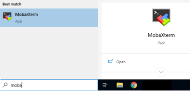
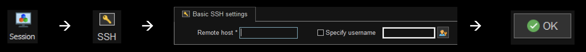

# How to run a GWAS in Generation R (for dummies)
Hi, you are about to enter the magic circle of people that can run a GWAS, welcome. You are going to need a little bit of UNIX witchery for this one, but if that sounds uninviting, no worries, you will have me (…and google) on your side every step of the way. We are going to use `R` for phenotype preparation and `Rvtest` to run the actual GWAS, but first things first:

## 0    | Set up access to GENA and to the genetic / phenotype data
You will need access to our **GENA** server where the genotype files are stored, and of course also permission to access the phenotype data. So, start by sending some emails. Marijn Verkerk (m.verkerk@erasmusmc.nl) will help you create an account on GENA. This will be accessible via remote shell (SSH) using your microsection credentials, but you can also ask for permission to use `MobaXterm` (a SSH client) on your SOM or Mijnwerkplek environment. This will make access a little bit easier and I am going to assume you are using MobaXterm in this tutorial. 

So, once the app becomes available you can launch it.



And set up your session:


Type `gena.erasmusmc.nl` as a Remote host and specify your **microsection number** as username, then type in your password and congrats, you are now inside your home folder. If you type `pwd` ("print working directory") you will see `/home/your microsection number`. 

Let’s have a look at what’s inside (type `ls`). You should see a folder called `GENR3`, that’s containing the genetic files you are going to need. If you don’t see it yet, write an email to data management (datamanagement@erasmusmc.nl) with Marijn in cc. 

> <ins>Note</ins> **GenR3 or GenR4 release?** 
For this tutorial I will be using GenR3, but there is also another more recent release, GenR4. infomation about these two samples can be found on the info wiki {...}

### Tip #1: keep things tidy!
The first thing I would do, once you have access to your home folder is setting up a structure for your analyses. You can start by creating a **project folder** inside your home, where you can keep your scripts, phenotype files and results stored neatly. To create a directory, use the command `mkdir` (“make directory”) followed by the folder name. For example, try typing `mkdir dummieGWAS` and then type `ls` again, you should see the new folder appearing in your home. 
To move inside the folder you just created you can use the command `cd` (“change directory”) followed by the folder name; for example, `cd dummieGWAS`. Once you are inside your project folder you can then create two more sub-folders like this:
```
mkdir sourcefiles
mkdir results
```
In the `sourcefiles` folder we are going to save the phenotype and some other useful files and in the `results` folder we are going to store, well, you guessed it, our GWAS results. If you are running multiple analyses (for example, supplementary analyses stratified by sex), be extra tidy and create a sub-folder for each:
```
cd results
mkdir {mainanalysis, girlsonly, boysonly}
```
For example, I just created a “mainanalysis”, “boysonly” and “girlsonly” sub-folders inside the results folder. 

P.s. If you made a mistake and you want to remove or rename a folder you can use the commands
`rm -d dummieGWAS` and/or `mv dummieGWAS expertGWAS`. The `mv` ("move") is a handy one since you can use it both to move files around and to rename files (try giving it a google, that'll make things clearer).

### Tip #2: Import and export files into and from the server
This is where `MobaXterm` will make your life a bit easier. You can use it to import files from your computer / Mijnwerkplek environment onto GENA and to export files that you have stored/created on GENA (e.g. your final results files) to your computer. I did forget to take screenshots of that, but you can fild the icons that'll allow you to do this in the left pane (the file explorer/hierarchy thingie) and I think even drag-and-drop may work. Anyway, Google will surely help better if you get stuck. 

### Inspect the genetic files (optional)
Now let’s nose around the genetic data a little (type `cd ~/GENR3` to move inside the GENR3 folder and `ls` to see what’s inside). For example, we are going to use the data in `Imputed/1000G_PhaseIIIv5/`. Here you will find the `*.vcf` and the `*.info` files for all chromosomes. You can visualize these using e.g., `zcat chr1.dose.vcf.gz | more` (hit `q` when you are done nosing around the vcf file) or `zcat chr1.dose.vcf.gz | head` (to visualize only the first 10 rows of the file). Also, `bcftools query -l chr1.dose.vcf.gz` will list all the participants in the file.

> **So many imputation panels ... which one do I choose?**

## 1    | Construct your phenotype & covariate files
While you are waiting for access to the server to be arranged, you can have some fun preparing the phenotype and covariates. You can download most of the Generation R data from the [data wiki](). Together with the files containing your outcome variables of interest you should probably download the most recent **ALLGENERALDATA[...].sav**, and **PCA_Selection_GWAv3[...].sav** or **PCA_Selection_GWAv4[...].sav** files (these refer to GenR3 and GenR4 respectively). 

You can merge and manipulate these using R or any other tool you like and save a dataset (I am going to call it **“phenotype_data.csv”**) that contains the following columns:
* Your **phenotype** and **covariates** (of course), massaged according to your analysis plan and ready to be used;
* The variable `GENDER` from the general data file that encodes participant's sex (1 for boys and 2 for girls);
* The variable `MOTHER` from the general data file that will be used to identify siblings and remove them;
* The ancestry principal component variables (`C1`, `C2`…) that you can find in the *PCA_Selection[...].sav* files. 
* The variable `GenRv3all` or `GENR4`, coded as NA when children have no genetic data available. These are also in the *PCA_Selection[...].sav* files. 

Now, let’s convert this into a set of files that Rvtest can use (.ped format), using our first R script: [**1_PhenotypeFormation.R**](https://github.com/SereDef/GenR-run-GWAS/blob/main/1_PhenotypeFormation.R). 
The first important thing is that your dataset should contain the following columns: 
* `fid`: the family ID (since I will remove siblings later on, family ID = IDC)
* `iid`: the participant ID (IDC)
* `fatid`: parental data (I won't use any so I set this to 0) 
* `matid`: maternal data (also set to 0)
* `sex` (0 for boys and 1 for girls)

These should be the *first columns* in the phenotype files so, as I am selecting participants with complete genetic data, phenotype and covariates (in this example, only sex and age), I will also reorder the columns appropriatly. 
Now this should be your analytical sample. You can check out some **descriptives** (making sure all looks right) and congratulate yourself for completing the first step. 

If all went well, the script will save a `phenotype.ped` and a `covariates.ped` file into our `sourcefiles` folder. <ins>Note</ins>: if you need to run supplementary analyses using other samples, save a phenotype file for each analytical sample. For example, since I am going to stratify my analyses by sex, I also save a `phenotype_girls.ped` and a `phenotype_boys.ped` file. 

## 2    | Start running the GWAS analyses
Ok, enough fooling around, time to run the actual analyses, using our second script [**2_Rvtest.sh**](https://github.com/SereDef/GenR-run-GWAS/blob/main/2_Rvtest.sh).
We will run the analyses, i.e., `phenotype ~ SNP + covariates` one chromosome at the time. To do so, we need to submit each *job* (i.e., chromosome analysis) to the *que*, using the `qsub` command. 
First, make sure you are inside your project directory and then you can paste the commands from script 2 into the command window (to paste, just right click will do). 
> To be honest I am not quite sure why, but when I simply run the .sh script, the qsub command is not recognised, hence the workaround of copy-pasting into the command window. If you know better though I am really curious to know what is going on here...

This is what the main command looks like:
```
for c in {1..22}
do
    if [ -f ~/GENR3/Imputed/1000G_PhaseIIIv5/chr${c}.dose.vcf.gz ]
    then
        echo "Chromosome $c"
        qsub-bin-long rvtest --inVcf ~/GENR3/Imputed/1000G_PhaseIIIv5/chr${c}.dose.vcf.gz --dosage DS --pheno sourcefiles/phenotype.ped --pheno-name phenotype_z --covar sourcefiles/covariates.ped --covar-name sex,age,C1,C2,C3,C4,C5,C6,C7,C8,C9,C10 --out results/mainanalysis/chr${c} --single score --noweb
    fi
done
```
You can find more information about the `rvtest` options [here](http://zhanxw.github.io/rvtests/).
In a nutshel, what this does is looping through all chromosomes (i.e., `.vcf` files) and tell `rvtest` to run the analysis using the phenotype and covariates files we created in step 1. Then save the output in the appropiate `results/` subfolder, for example `mainanalysis`. 

Ok, this may take some time, so you can allow yourself a nice walk / a ~20 min Netflix episolde at this point. You can come back and check the status of your analyses using the command `qstat`. This will print out a list of the *jobs* that are currently being run (`r`) or are waiting in the que (`wq`). If the output of `qstat` is empty you are all done. 

<ins>Note</ins> Analyses have the bad habit of having something wrong with them sometimes. Make sure you inspect the **log files** for any shady warnings going on. For each *job* you have submitted, you will find a couple of those in your project folder: `rvtest.e[...]` and `rvtest.o[...]`. The latter is not super useful but it does provide some contact and websites where you can check the rvtests documentation (although probably faster way to get there is to google rvtest...). Open the first ("e") log file using `cat rvtest.e*somenumber*` (*tip*: if you hit `shift` computers will fill in the numbers for you). If anything goes wrong, this is were you are going to know more about it.

## 3.1  | Get HWE and imputation quality (R<sup>2</sup>) information 
Next, we need to retrieve some important information on Hardy-Weinburgh Equilibium and imputation quality. And that is what [**3_CollectGenotypeInfo.sh**](https://github.com/SereDef/GenR-run-GWAS/blob/main/3_CollectGenotypeInfo.sh) is all about. In your project folder paste the command: 
```
plink --bfile ~/GENR3/Genotyped/GENR3-2012 --hardy --out /sourcefiles/GenR 
gzip sourcefiles/GenR.hwe
```
Which uses [plink](https://zzz.bwh.harvard.edu/plink/) and the `GENR3-2012.bed` `.bim` `.fam` files to compute Hardy-Weinburgh Equilibium. 

> **What is HWE?** {...}

We then extract the imputation quality information from the `.info` chromosomes files, like this:
```
zcat ~/GENR3/Imputed/1000G_PhaseIIIv5/chr22.info.gz | head -n1 > sourcefiles/rsq.txt
for fname in ~/GENR3/Imputed/1000G_PhaseIIIv5/chr*.info.gz
do
   zcat $fname | tail -n+2 -q >> sourcefiles/rsq.txt
   echo $'\n' >> sourcefiles/rsq.txt
done
sed -i '/^$/d' sourcefiles/rsq.txt
gzip sourcefiles/rsq.txt
```
> **How does imputation work?** {...}

## 3.2  | Merge results 
Finally, you may want to merge all of these chromosome-specific result files into a **genome-wide** file that is easier to use and share. This is what the last part of [3_CollectGenotypeInfo.sh](https://github.com/SereDef/GenR-run-GWAS/blob/main/3_CollectGenotypeInfo.sh) does. For example let's merge all results from the main analyses into a `main_autosomal.csv` results file:
```
gzip -r results/mainanalysis/
zcat results/mainanalysis/chr22.SingleScore.assoc.gz | head -n1 > results/main_autosomal.csv
for fname in results/mainanalysis/chr*.SingleScore.assoc.gz
do
   zcat $fname | tail -n+2 >> results/main_autosomal.csv
done
gzip results/main_autosomal.csv
```

## 4    | Create the final results file 
Ok we are really nearly done! But we still need to combine our results with information on imputation quality, HWE etc, filter out sites as specified in the analysis plan and save the final results files. We will be doing this using the final [**4_MergeAllResults.txt**](https://github.com/SereDef/GenR-run-GWAS/blob/main/4_MergeAllResults.txt) script. This is actually an R script (despite the .txt extention, yes...). You could run this in Rstudio, but we are going to be handlying large datafiles and you will probably run into memory problems (there is only that much allocated RAM per user). So, we saved this R script in .txt format and send it once again to the *que* using the command: 
```
qsub-bin-long Rscript --vanilla 4_MergeAllResults.txt
```
You can go ahead and modify this script to implement the filtering that you prefer, but note that the script should start with the line `#!/bin/bash` and be in `.txt` format.

## The end :) 
That's it. You have run your lovely GWAS using Generation R data, Congrats!

Please note that this tutorial is very much a work in progress so if you run into any issues or if there is anything that you would like to add, please contact me (s.defina@erasmusmc.nl), I am happy to chat and collaborate!

Cheers!


